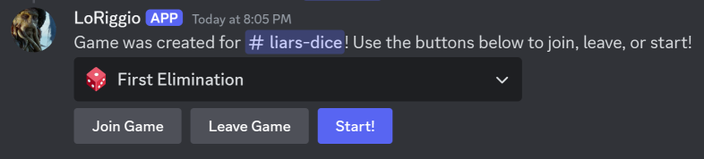
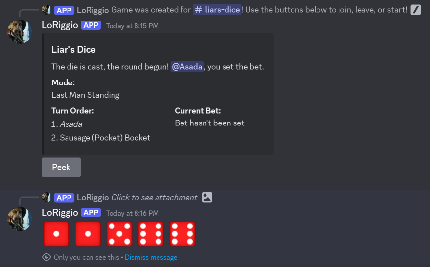
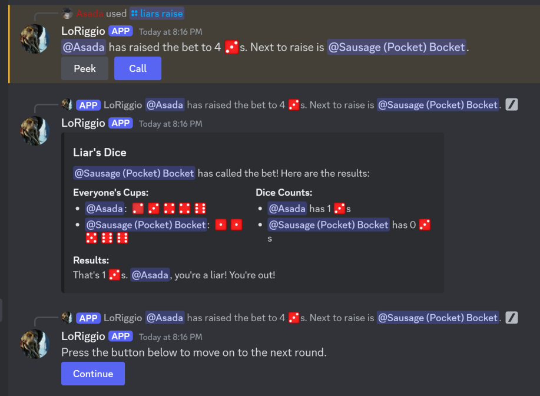

# LoRiggioDev
 A Discord bot for playing Liar's Dice. This is mainly a way for me to keep track of my history
on this development and is not polished for public use. I'm not hosting a public instance of this
bot for people to use, but the code is here if you want to look at it.

---

## Tips for running the bot

If you want to run the bot yourself,
you will need to create a bot account through Discord's Developer Portal.
It needs your typical OAuth2 permissions, mainly sending messages and reading message history.

To get this to work, you need a "config.json" file in the same directory as "LoRiggio.py".
If you don't have one, one will be created the first time you run the program.

This file has to contain the following:
```
{
  "token":  "YOUR_BOT_TOKEN_HERE"
}
```

The bot also makes use of custom emojis to help the display look better. These are stored in the "images" subdirectory,
but they have to be uploaded as custom emojis to your bot account through the Discord Developer Portal
(or you could add them as custom emojis to a dummy server, that's what I did at first).

---

## Screenshots



